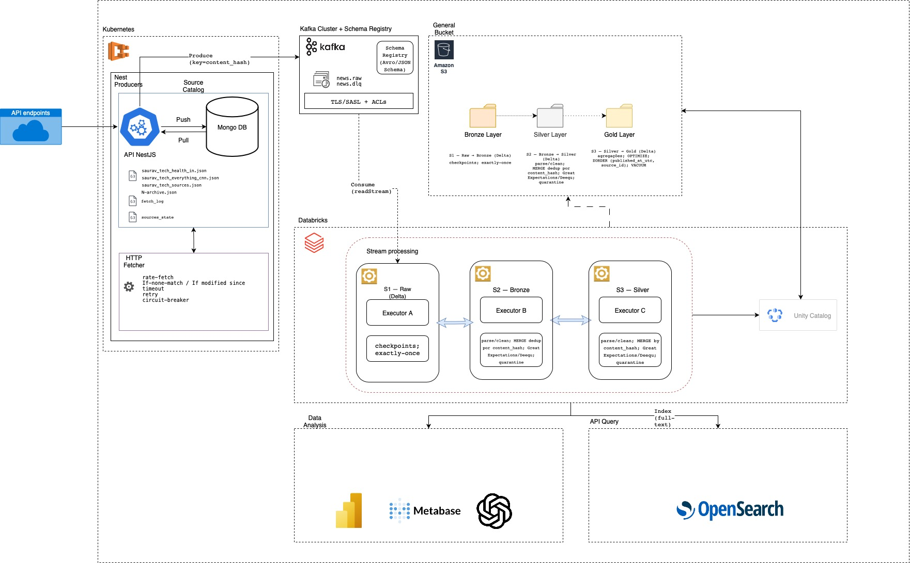

# Arquitetura Market Pulse — Real-time with Kafka: Detalhamento Técnico

## 1) Objetivo e Princípios de Design

**O que queremos:** Coletar notícias de centenas de fontes, padronizar, deduplicar e disponibilizar em quase tempo real para busca e análise.

**Princípios:**
* **Acoplamento baixo:** Ingestão separada do processamento (Kafka) para não derrubar tudo em caso de pico/queda de fonte.
* **Idempotência e reprocesso:** Cada artigo terá uma chave única; conseguimos reexecutar uma janela sem duplicar dados.
* **Custo previsível:** Armazenamento barato em S3/Delta, computação elástica apenas quando necessário.
* **Governança e segurança:** Unity Catalog (catálogo/ACLs), KMS no S3, TLS/SASL no Kafka.

**Por que isso é bom para a Ambev:** Reduz risco operacional, controla gastos e dá base de compliance para auditorias.

## 2) Catálogo de Fontes (MongoDB)

**O que é:** A lista oficial de endpoints com seu estado (ETag/Last-Modified), prioridade e limites de taxa.

**Como funciona:** Atualizamos o catálogo sem redeploy; cada fonte pode ser ligada/desligada, ter cabeçalhos de autenticação, prioridade e rate-limit próprios.

**Por que assim:** Separar configuração de código acelera mudanças e evita hardcode de fontes. O estado HTTP permite uso de cache (If-None-Match/If-Modified-Since), economizando chamadas e custo.

**Valor para a Ambev:** Governança operacional — “o que coletamos, quando e como” fica rastreável e auditável.

## 3) Ingestão com NestJS (Kubernetes)

**O que faz:** Transforma pull HTTP em eventos Kafka de forma resiliente.

**Detalhes técnicos:**
* **BullMQ + Redis** para agendamento/concorrência, rate-limit por host/fonte, retry/backoff e DLQ.
* **HTTP robusto:** timeout, retries, circuit-breaker; uso de ETag para evitar baixar conteúdo repetido.
* **Idempotência:** Geramos `content_hash = sha256(source_id|url|publishedAt|title)` como `key` da mensagem → duplicatas caem na mesma partição.
* **Observabilidade:** OpenTelemetry (traces), métricas (latência de fetch, taxa de erro, throughput).

**Por que assim:** NestJS é ótimo para I/O de rede e resiliência; e manter a borda HTTP fora do cluster analítico evita “queimar” recursos de processamento só para esperar respostas de APIs.

## 4) Barramento de Eventos (Kafka + Schema Registry)

**Papel:** Desacoplar ingestão de processamento; agir como buffer e “caixa-preta” de entrada.

**Tópicos:** `news.raw` (entrada bruta) e `news.dlq` (falhas irrecuperáveis).

**Contratos:** Avro/JSON Schema com Schema Registry (compatibilidade `BACKWARD`).

**Segurança:** TLS/SASL + ACLs.

**Particionamento:** Dimensionado pelo volume (alvo 500–1000 msgs/s por partição); `key=content_hash` para manter ordem relativa da mesma notícia.

**Por que assim:** Garante escala horizontal, reprocesso simples (reler do offset) e contratos estáveis de dados.

## 5) Processamento Contínuo (Databricks Streaming – S1/S2/S3)

Executamos três jobs contínuos com checkpoints (exactly-once), evitando perda/duplicação.

### S1 — Raw → Bronze (Delta)
* Leitura do `news.raw`; gravação no S3/Delta particionada por `ingest_date`, `hour`, `source_id`.
* **Por que:** Imutável, barato, reprocessável. Se o parser mudar, não dependemos do Kafka para recomputar.

### S2 — Bronze → Silver (Delta)
* **Normalização:** Parse de JSON, limpeza (timezone, campos), enriquecimento (idioma/país).
* **Deduplicação idempotente:** `MERGE` por `content_hash` (insere/atualiza somente o mais recente).
* **Qualidade:** Great Expectations/Deequ (título e URL válidos, datas plausíveis). Rejeitos vão para `quarantine`.
* **Esquema canônico:** Tabela `silver.articles` com `_ingest_date` (partição).
* **Por que:** Concentra “regras de negócio de dados” (dedup/qualidade) num ponto único e auditável.

### S3 — Silver → Gold (Delta)
* **Materializações** para consumo: ex. `gold.articles_daily`, `gold.sources_stats_daily`.
* **Performance:** `OPTIMIZE + ZORDER` por (`published_at_utc`, `source_id`), `VACUUM` e arquivos 128–256 MB.
* **Acesso:** SQL Warehouse (serverless) para BI e APIs.
* **Benefício para Ambev:** Consultas rápidas e baratas; camadas isolam responsabilidades (histórico, curadoria, consumo).

## 6) Armazenamento e Governança (S3 + Delta Lake + Unity Catalog)

* **Bronze:** Eventos brutos particionados (`ingest_date/hour/source_id`).
* **Silver:** Curado + dedup, partição por `_ingest_date`.
* **Gold:** Consumo analítico (`ZORDER`).
* **Unity Catalog:** Catálogo único, permissões granulares, lineage e auditoria.

**Por que assim:** Delta dá ACID + time-travel com custo de S3. UC garante governança corporativa exigida por auditorias.

## 7) Busca em Baixa Latência (OpenSearch)

* Índice alimentado a partir do Silver (stream/micro-batch) com `title`, `content`, `published_at_utc`, `source_id`, `language`, `article_id`.
* **Config:** `refresh_interval=1–2s`; analisadores para PT/EN.
* **Uso:** Endpoints de “listar mais recentes” e “buscar por palavra-chave”.

**Por que do Silver:** Já deduplicado/limpo → menos ruído, menos retrabalho.

**Valor para Ambev:** Resposta imediata em buscas e filtros — experiência de usuário melhor e custo previsível (index só do necessário).

## 8) Camada de Visualização e APIs Internas

* **BI (Power BI/Metabase)** lê Gold via SQL Warehouse (governado pelo UC).
* **API de leitura (para apps internos):**
    * `GET /articles/latest` (paginação, ordenado por `published_at_utc` via OpenSearch + cache Redis 5–15s);
    * `GET /articles/search?q=...` (OpenSearch);
    * `GET /articles/{id}` (Gold/SQL Warehouse ou OpenSearch por `_id = article_id`).

**Por que assim:** Separa workloads: full-text no OpenSearch, analítico no Gold.

## 9) Orquestração e Operações (Airflow – Control Plane)

**Não fica no caminho de dados.**

**Tarefas:** Iniciar/parar streams; agendar `OPTIMIZE/VACUUM`; backfills (reprocesso por data/fonte); checks de saúde.

**Por que:** Padroniza operação, reduz `toil` e facilita SRE (alertas, SLAs).

## 10) Qualidade, Segurança e Observabilidade

* **Data Quality:** Great Expectations/Deequ no Silver com alertas + `quarantine`.
* **Segurança:** S3 SSE-KMS; Secrets Manager (creds); Kafka TLS/SASL + ACLs; UC para permissões.
* **Observabilidade:** OpenTelemetry (traces), Prometheus/Grafana (lag do Kafka, p95 do stream, throughput), alertas Slack.

**Por que:** Postura corporativa de segurança e confiabilidade, com trilha de auditoria.

## 11) Idempotência e Deduplicação (Como evitamos “notícia repetida”)

* **Chave única:** `content_hash` (fonte + URL + data + título).
* **Kafka key:** Garante que duplicatas caiam na mesma partição (ordem relativa).
* **MERGE no Silver:** Só insere se não existe; se existir e for mais recente, atualiza.

**Benefício:** Sem “spam” de notícias repetidas e reprocessos seguros.

## 12) Escalabilidade e Custo

* **Escala horizontal:** Mais partições Kafka, mais consumers Spark, HPA no Nest.
* **Custo controlado:** Dados no S3; Serverless no SQL Warehouse; `OPTIMIZE/VACUUM` focados nos últimos dias; `refresh_interval` do OpenSearch calibrado.
* **Picos sazonais:** O Kafka amortiza `burst`; streams se ajustam pelo `lag`.

**Para a Ambev:** Paga-se pelo uso (compute elástico), mantendo histórico barato no S3.

## 13) Riscos e Mitigação

* **Rate-limit/ban das fontes:** Pools por host, backoff com jitter, respeito a `robots.txt`, contato de abuse quando aplicável.
* **Mudança de esquema nas fontes:** Schema Registry (compat `BACKWARD`) e `rescued data column` para campos novos.
* **Small files problem:** `OPTIMIZE` e tamanho-alvo de arquivo; `triggers` de streaming com micro-batch adequado.
* **Cold start de clusters:** Usar Jobs/SQL Warehouse serverless.
